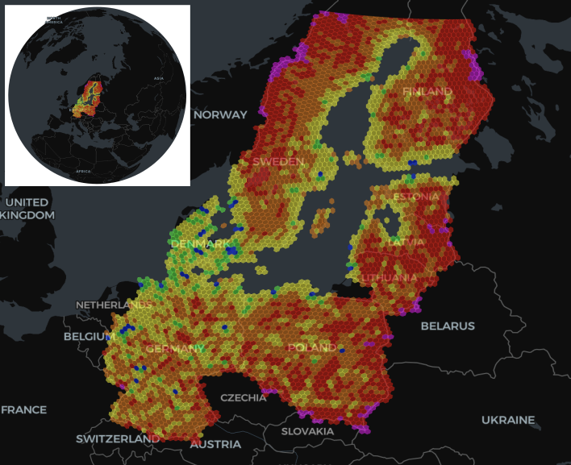

# pydggsapi

A python FastAPI OGC DGGS API implementation

https://pydggsapi.readthedocs.io/en/latest/

## OGC API - Discrete Global Grid Systems

https://ogcapi.ogc.org/dggs/

OGC API - DGGS specifies an API for accessing data organised according to a Discrete Global Grid Reference System (DGGRS). A DGGRS is a spatial reference system combining a discrete global grid hierarchy (DGGH, a hierarchical tessellation of zones to partition) with a zone indexing reference system (ZIRS) to address the globe. Aditionally, to enable DGGS-optimized data encodings, a DGGRS defines a deterministic for sub-zones whose geometry is at least partially contained within a parent zone of a lower refinement level. A Discrete Global Grid System (DGGS) is an integrated system implementing one or more DGGRS together with functionality for quantization, zonal query, and interoperability. DGGS are characterized by the properties of the zone structure of their DGGHs, geo-encoding, quantization strategy and associated mathematical functions.

## Setup
Please refer to the [Quick Setup](https://pydggsapi.readthedocs.io/en/latest/introduction.html#quick-setup) section from the documentation for details.

## Configration and implementation details

Please refer to the [Configuration](https://pydggsapi.readthedocs.io/en/latest/tinydb_configuration/index.html) section from the documentation for details.

## Example notebook
Please refer to the [Example](https://pydggsapi.readthedocs.io/en/latest/example_notebook/pydggsapi_demo_notebook.html#) section from the documentation for demonstration.

## Conformance Classes

The API implemented the dggrs-core, zone-query and zone data retrieval, conformal class. The following list shows the conformance classes supported by the API. Users can also refer to the [example notebook](https://pydggsapi.readthedocs.io/en/latest/example_notebook/Endpoints_Examples.html) from the pydggsapi documentation for examples of the query endpoints.

| Conformance Class| Supported by the API|
| ---------------- | ------------------- |
| **Core**         |                     |
| http://www.opengis.net/spec/ogcapi-common-1/1.0/conf/core | ✅ |
| **OGC API integration**|               |
| https://www.opengis.net/spec/ogcapi-dggs-1/1.0/conf/root-dggs | ✅ |
| https://www.opengis.net/spec/ogcapi-dggs-1/1.0/conf/collection-dggs | ✅ |
| https://www.opengis.net/spec/ogcapi-dggs-1/1.0/conf/operation-ids | ❌ |
| **For Data Retrieval**|                |
| https://www.opengis.net/spec/ogcapi-dggs-1/1.0/conf/data-retrieval | ✅ |
| https://www.opengis.net/spec/ogcapi-dggs-1/1.0/conf/data-subsetting | partially: `datetime`, `properties` and `exclude-properties`|
| https://www.opengis.net/spec/ogcapi-dggs-1/1.0/conf/data-custom-depths | ✅ |
| https://www.opengis.net/spec/ogcapi-dggs-1/1.0/conf/data-cql2-filter | ✅ |
| **For Zone Queries**|                  | 
| https://www.opengis.net/spec/ogcapi-dggs-1/1.0/conf/zone-query | ✅ , query parameter `subset` and `subset-crs` is not supported yet|
| https://www.opengis.net/spec/ogcapi-dggs-1/1.0/conf/zone-query-cql2-filter | ✅ |
| **Zone Data Encodings**|               |
| https://www.opengis.net/spec/ogcapi-dggs-1/1.0/conf/data-json | ✅ |
| https://www.opengis.net/spec/ogcapi-dggs-1/1.0/conf/data-ubjson | ✅ | 
| https://www.opengis.net/spec/ogcapi-dggs-1/1.0/conf/data-dggs-jsonfg | ✅ |
| https://www.opengis.net/spec/ogcapi-dggs-1/1.0/conf/data-dggs-ubjsonfg | ✅ |
| https://www.opengis.net/spec/ogcapi-dggs-1/1.0/conf/data-geojson | ✅ |
| https://www.opengis.net/spec/ogcapi-dggs-1/1.0/conf/data-geotiff | ❌ |
| https://www.opengis.net/spec/ogcapi-dggs-1/1.0/conf/data-netcdf | ❌ |
| https://www.opengis.net/spec/ogcapi-dggs-1/1.0/conf/data-coveragejson | ❌ |
| https://www.opengis.net/spec/ogcapi-dggs-1/1.0/conf/data-zarr | ✅ |
| https://www.opengis.net/spec/ogcapi-dggs-1/1.0/conf/data-jpegxl | ❌ |
| https://www.opengis.net/spec/ogcapi-dggs-1/1.0/conf/data-png | ❌ |
| **Zone List Encodings**|                |
| https://www.opengis.net/spec/ogcapi-dggs-1/1.0/conf/zone-html | ❌ |
| https://www.opengis.net/spec/ogcapi-dggs-1/1.0/conf/zone-uint64 | ❌ | 
| https://www.opengis.net/spec/ogcapi-dggs-1/1.0/conf/zone-geojson | ✅ |
| https://www.opengis.net/spec/ogcapi-dggs-1/1.0/conf/zone-geotiff | ❌ |

## Acknowledgments

This software is being developed by the [Landscape Geoinformatics Lab](https://landscape-geoinformatics.ut.ee/expertise/dggs/) of the University of Tartu, Estonia.

This work was funded by the Estonian Research Agency (grant number PRG1764, PSG841), Estonian Ministry of Education and Research (Centre of Excellence for Sustainable Land Use (TK232)), and by the European Union (ERC, [WaterSmartLand](https://water-smart-land.eu/), 101125476 and Interreg-BSR, [HyTruck](https://interreg-baltic.eu/project/hytruck/), #C031).
